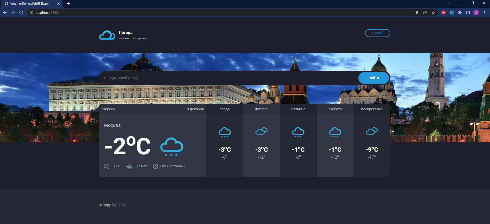
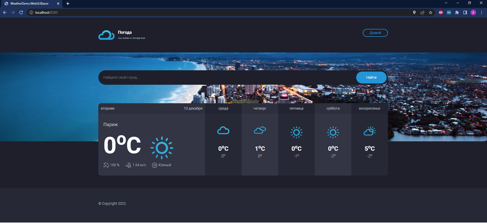

# Weather Demo Project

## Краткое описание

Приложение состоит из двух частей

1) Серверная часть - REST API - WeatherDemo.WebApi
Запускается и работает независимо от клиента.

2) Клиентская часть - веб приложение WeatherDemo.WebUI.Blazor
Реализует UI как Blazor Webassembly и может хоститься на статическом сайте.

## API KEY 

Для работы приложения необходимо получить API KEY для взаимодействия с Open Weather Map API

Бесплатный ключ можно получить зарегистровавшись в [Open Weather](https://openweathermap.org/appid)


## Запуск приложения в Docker-Compose


- в окне терминала собрать контейнеры командой

```
    docker-compose build
```

Перед запуском необходимо указать API KEY в соответствующей секции docker-compose.yml файле.

Либо возможно указать APIKEY в переменной окружения, как описано ниже:

```
SET APIKEY=Api_Key_From_Open_Weather
```

- запустить контейнеры

```
    docker-compose up
```

Основное приложение будет доступно по адресу [http://localhost:8585/](http://localhost:8585/)

## Запуск приложения из Visual Studio 

Для солюшена настроить одновременный запуск проектов

- WeatherDemo.WebApi

- WeatherDemo.WebUI.Blazor

В проекте WeatherDemo.WebApi в файле launchSettings.json указать API KEY

Запустить солюшен командой Start или по F5.


## Запуск приложения из командной строки


### Серверная часть

- в окне терминала перейти на папку проекта WeatherDemo.WebApi

- в файле appsettings.json указать API KEY

- запустить приложение командой **dotnet run**

- можно открыть свагер по адресу:

-- [http://localhost:8686/swagger](http://localhost:8686/swagger)

### Клиенская часть

- в окне терминала перейти на папку проекта WeatherDemo.WebUI.Blazor

- запустить приложение командой **dotnet run**

- открыть браузер по адресy:

-- [http://localhost:8585/](http://localhost:8585/)

## Структура солюшена

### WeatherDemo.External.OpenWeatherMap 

Клиент для коммуникации с [Open Weather Map API](https://openweathermap.org/api/geocoding-api)

Для других частей системы реализует сервис **IOpenWeatherMapService**

Настройки клиента находятся в секции OpenWeatherMap конфига appsettings.json в WeatherDemo.WebApi

### WeatherDemo.Application

Реализует слой бизнес логики - Application Services

Использует в работе [MediatR](https://github.com/jbogard/MediatR)

### WeatherDemo.Domain и WeatherDemo.Domain.Shared

Доменная модель для приложения.

### WeatherDemo.Infrastructure.Data.SQLite

Слой доступа к данным. Использует EF Core ORM. Релизован подход Code First с миграциями.

В качестве БД используется SQLite 

Строка соединения к БД указывается в секции SqliteDbContext конфига appsettings.json в WeatherDemo.WebApi

Хранит информацию о геолокации, запрошенную в процессе работы приложения.

### WeatherDemo.Infrastructure.InMemory

Реализует слой кэширования запросов к прогнозам.

Настройки времени экспирации кэша находятся в секции WeatherInfoCache конфига appsettings.json в WeatherDemo.WebApi


### WeatherDemo.WebApi 

REST API приложения. Реализует два контроллера

**WeatherController** - основной рабочий контроллер для работы с UI

**GeoLocationController** - служебный REST API интерфейс для коммуникации с БД геолокации


### WeatherDemo.WebApi.Client

Клиент для WeatherDemo.WebApi

Используется внутри Blazor приложения для формирования запросов к REST API 

Все клиенты к REST в приложении реализованы через бибилиотеку [RestEase](https://github.com/canton7/RestEase)


### WeatherDemo.WebUI.Blazor

Клиентское Web приложение. 

По пути wwwroot/appsettings.json находится конфиг секция WeatherDemoApiBaseAddress с адресом серверной части (WeatherDemo.WebApi)  

Логика клинтской части реализована в **Index.razor.cs**







## Ограничения и допущения при расчете метеоданных

- Погода на дату расчитывается на UTC время - без учета локальной таймзоны
- Дневная и ночная температура рассчитывается как максимальная и минимальная суточная температура
- Вероятность осадков на текущую дату берется как максимум из форекаста на этот день
- Локации хранятся с русскими и анлгийскими названиями. Это значит, что запросы на др.языках не кешируются. Но можно легко добавить поддержку любых/всех языков.

## Технические замечания 

Для помышленной эксплуатации нужно 

- заменить InMemory кэш на внешнее хранилище - Redis или MemCached
- заменть БД c SQLite на PgSQL. Реализовать DAL для PgSQL. В БД сделать оптимизацю таблиц и настроить индексы

## На доработку

- Реализовать клиента к внешнему сервису поиска картинок по геокоординатам. Сохранять информацию по найденным картинкам в БД.
- Реализовать альтернатиные коннекторы к внешним сервисам поиска локации по геокоординатам.
- Рефакторинг Blazor клиента. Обработка ситуаций с недоступностью данных о погоде.

